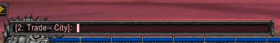

## Linkerator

Have you ever wanted to tell your friends about some impressive loot you saw another adventurer using? Share your regret about the quest reward you foolishly didn't choose? Spread word to your guild of what your raiding party found?

This is a modern revival of Gazmik Fizzwidget's classic **Linkerator** addon! It brings back the simple, intuitive linking functionality we all loved, but now it's powered by the massive and up-to-date **Ludwig** item database.

### Features

-   **Automatic Item Linking:** Allows you to insert an item link in chat by merely typing its name in brackets. For example, typing `/g [Arcanite Bar]` will automatically send a message to your guild with a clickable link.
-   **Smart Autocomplete:** As you type a link like `[Symbol of...`, Linkerator will only complete the name if there's just one possible match. No more fighting Linkerator when typing items with similar names!
-   **Instant Linking:** Pressing **Tab** or closing a bracket with **`]`** on a partial item name will instantly find the closest match and turn it into a full, clickable link right in your chat box.
-   **Paste and Go:** You can copy and paste entire messages that already contain item links, and they will be preserved perfectly. Any un-linked items in brackets will be converted automatically when you send.

### Advanced Linking & Shortcodes

My version of Linkerator supports a shortcode system for creating precise item links, perfect for macros or advertising. Linkerator is smart (I think), if you provide an invalid Suffix or Enchant ID, it will gracefully fall back to linking the valid base item.

-   **Link by Item ID:** `[#19019]` will link `[Thunderfury, Blessed Blade of the Windseeker]`.
-   **Link with a Suffix:** `[#9789/846]` will link `[Raider's Legguards of the Eagle]`.
-   **Link with an Enchant:** `[#1951.250]` will link a `[Blackwater Cutlass]` with a Minor Striking enchant.
-   **Link with Both:** `[#ItemID/SuffixID.EnchantID]` works for items with both a random property and an enchant.

**Shortcode Helper:** When you link an item from your bags that has an enchant or suffix, Linkerator automatically prints its shortcode to your chat for easy copying!
> [Linkerator]: [Raider's Belt of the Bear] - Shortcode: [#9788/1182]

### Installation (Required!)

Linkerator is a bridge for Ludwig and **will not work without it.**

1.  First, make sure you have **Ludwig** and **Ludwig_Data** installed. You can get them from the official CurseForge page: [https://www.curseforge.com/wow/addons/ludwig](https://www.curseforge.com/wow/addons/ludwig)
2.  Install **Linkerator**. Ensure all three folders (`Ludwig`, `Ludwig_Data`, and `!Linkerator`) are in your `World of Warcraft\_classic_\Interface\AddOns\` folder.

There is no configuration required. If Ludwig is installed, Linkerator will work.

### Credits

This addon stands on the shoulders of giants. All credit for the brilliant original work goes to:

-   **Gazmik Fizzwidget:** For the original concept and user experience of Linkerator. ([fizzwidget.com](http://fizzwidget.com/) - non HTTPS, sorry!)
-   **Jaliborc & Tuller:** For creating and maintaining the incredible [Ludwig](https://www.curseforge.com/wow/addons/ludwig) database addon.
